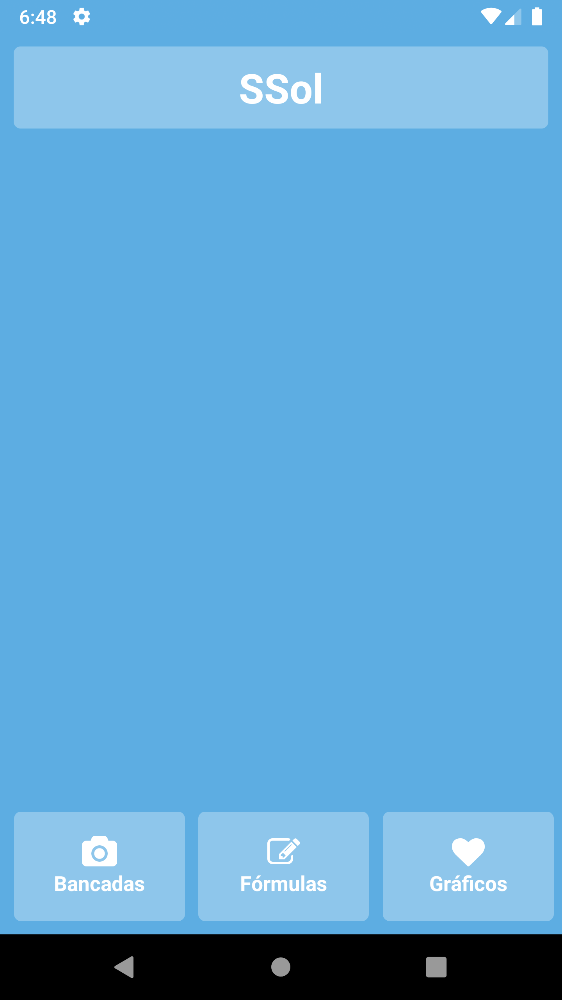
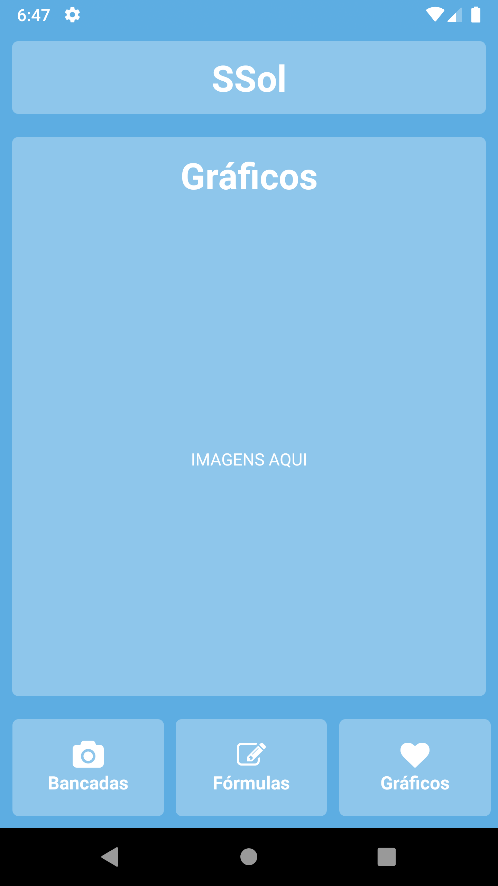
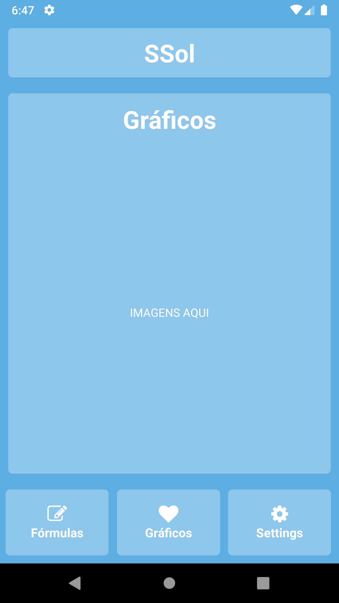
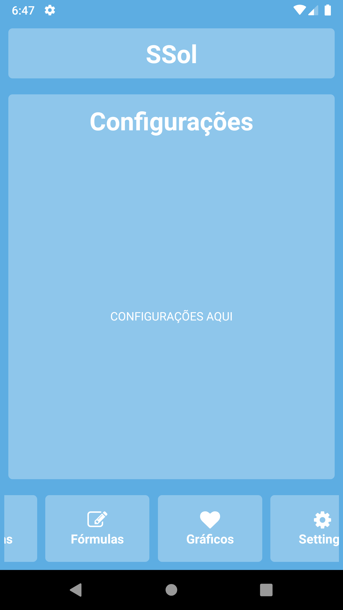

# Mobile Application

This repository maintain the code for the React-Native Application. Below there's a screenshot for the actual  version of the available code of the repository.

<table>
<tbody>
<tr>
<td align="center"></td>
<td align="center"></td>
</tr>
<tr>
<td align="center"></td>
<td align="center"></td>
</tr>
<td align="center"></td>
</tr>
</table>

<b>SSol</b>

Projeto Integrador de Engenharias 1  

